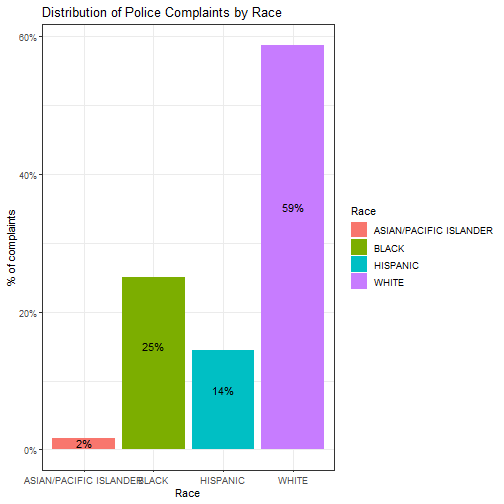
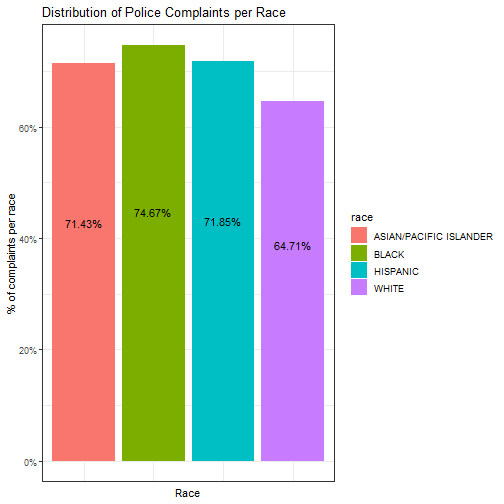
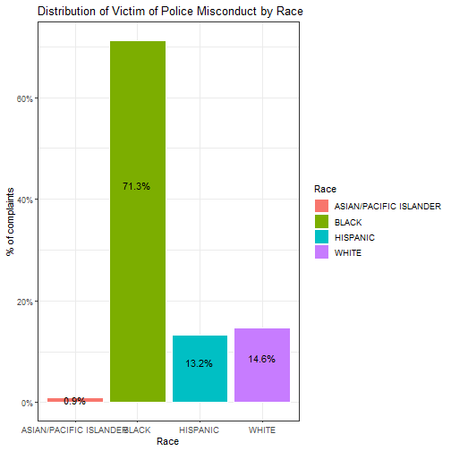
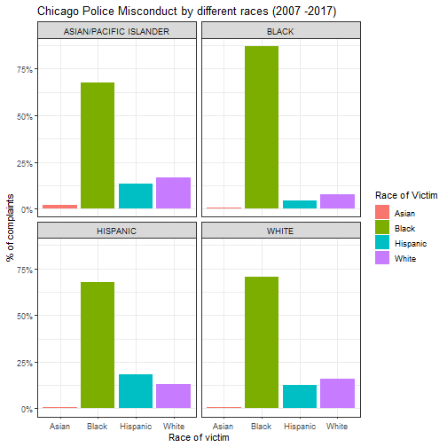
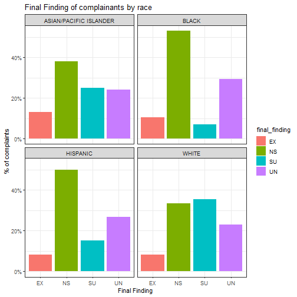
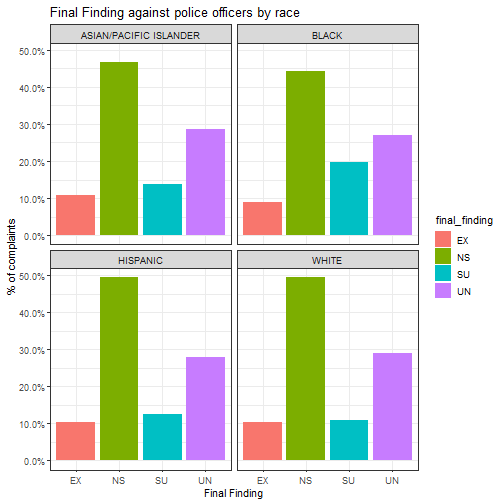
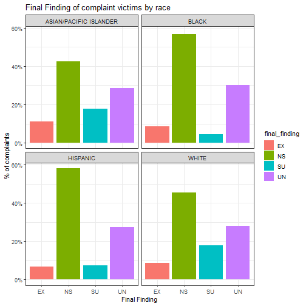
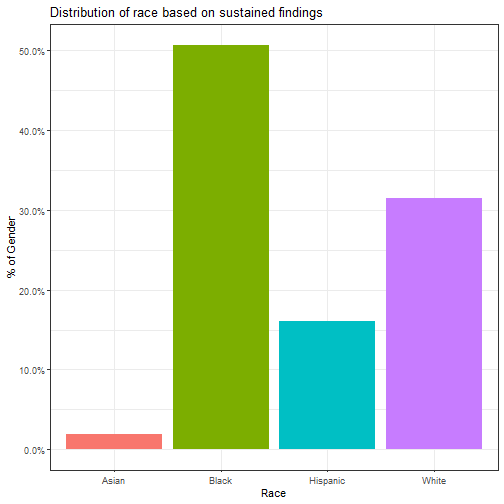

## Chicago Police Complaints by Race
Sambhav Shrestha  

06/25/2021


### Introduction

The purpose of this project was to analyze the correlation between the race and complaints against Chicago police officers. Analysis was done to compare the association between the race of the complainant, the race of the offending officer, race of the victim, and whether complaints by people of one race were more likely to have their complaints sustained than people of the other races. A sustained finding occurs when the police department decides that there is enough evidence to support a complaint. 

All data used in this project was taken from [chicago police data](https://github.com/invinst/chicago-police-data) which contains data on complaints against police officers from chicago police department. 

### Importing the library

```r
library(tidyverse)
library(scales)
```


### Import the required datasets

```r
# Chicago 

# contains data of accused officers
chicago_accused <- read_csv('data/chicago_accused.csv') %>% 
  mutate(cr_id  = as.numeric(cr_id))
```

```
## Error: 'data/chicago_accused.csv' does not exist in current working directory ('C:/Users/Sambhav Shrestha/Documents/DS3 Project/officer-complaints-2021-group-6/Police_Complaints_Extension').
```

```r
# contains all the closed complaints between 2007 and 2017
chicago_all_complaints <- read_csv('data/chicago_complaints.csv') %>%
  filter(between(complaint_date, as.Date("2007-01-01"), as.Date("2017-12-31")), between(closed_date, as.Date("2007-01-01"), as.Date("2017-12-31")))
```

```
## Error: 'data/chicago_complaints.csv' does not exist in current working directory ('C:/Users/Sambhav Shrestha/Documents/DS3 Project/officer-complaints-2021-group-6/Police_Complaints_Extension').
```

```r
# contains data of vicitims from police
chicago_victims <- read_csv('data/chicago_victims.csv')
```

```
## Error: 'data/chicago_victims.csv' does not exist in current working directory ('C:/Users/Sambhav Shrestha/Documents/DS3 Project/officer-complaints-2021-group-6/Police_Complaints_Extension').
```

```r
# contains data of complainants from police
chicago_complainants <- read_csv('data/chicago_complainants.csv')
```

```
## Error: 'data/chicago_complainants.csv' does not exist in current working directory ('C:/Users/Sambhav Shrestha/Documents/DS3 Project/officer-complaints-2021-group-6/Police_Complaints_Extension').
```

```r
# contains data of officer_final_profiles
chicago_profiles <- read_csv('data/chicago_final_profiles.csv')
```

```
## Error: 'data/chicago_final_profiles.csv' does not exist in current working directory ('C:/Users/Sambhav Shrestha/Documents/DS3 Project/officer-complaints-2021-group-6/Police_Complaints_Extension').
```


### Data analysis

### Distribution of Police complaints by Race

First, I analyzed the distribution of police officers in Chicago police department by race. As expected, the demographics was 60% white, 25% black, 14% hispanic and 2% asian. Then I analyzed the race of the police officers that were accused in a complaint. When compared to the overall population, the distribution of accused population was even. More than 70% of each race were accused at least once for any misconduct, which is really huge. Furthermore, when I compared the numbers of police officers by race, white police officers had more than 15000 complaints. 


```r
# get the distribution of police complaints by race, also drop the native american as they 
# have very small amount
chicago_profiles %>%
  filter(link_UID %in% unique(chicago_accused$link_UID), race != 'NATIVE AMERICAN/ALASKAN NATIVE') %>%
  drop_na(race) %>%
  group_by(race) %>%
  summarize(count = n()) %>%
  ggplot(aes(x = race, y = count/sum(count), fill = race)) + 
  geom_bar(stat = "identity") +
  geom_text(aes(label = percent(count/sum(count))), position = position_stack(vjust = 0.6)) +
  scale_y_continuous(labels = percent) +
  scale_fill_discrete("Race") +
  labs(x = "Race", y = "% of complaints", title = "Distribution of Police Complaints by Race")
```



```r
# create a table of all 4 races of total police officers and their count
cpd_race <- chicago_profiles %>%
  drop_na(race) %>%
  group_by(race) %>%
  summarize(race_count_all = n())

# create a table of all 4 races of accused police officers and their count
cpd_accused_race <- chicago_profiles %>%
  filter(link_UID %in% unique(chicago_accused$link_UID)) %>%
  drop_na(race) %>%
  group_by(race) %>%
  summarize(race_count_accused = n())


# join and plot them in a bar graph
inner_join(cpd_race, cpd_accused_race) %>%
  filter(race != 'NATIVE AMERICAN/ALASKAN NATIVE') %>%
  mutate(accused_frac = race_count_accused / race_count_all) %>%
  ggplot(aes(x = race, y = accused_frac, fill = race)) +
  geom_bar(stat = "identity") +
  geom_text(aes(label = percent(accused_frac)), position = position_stack(vjust = 0.6)) +
  labs(x = "Race", y = "% of complaints per race", title = "Distribution of Police Complaints per Race") +
  scale_y_continuous(labels = percent) + 
  theme(axis.ticks.x = element_blank(),
        axis.text.x = element_blank())
```

```
## Joining, by = "race"
```



```r
# plot the number distribution of race
cpd_accused_race %>%
  filter(race != 'NATIVE AMERICAN/ALASKAN NATIVE') %>%
  ggplot(aes(x = race, y = race_count_accused, fill = race)) +
  geom_bar(stat = "identity") +
  labs(x = "Race", y = "NO. of complaints per race", title = "Distribution of Police Complaints per Race") +
  scale_y_continuous() + 
  theme(axis.ticks.x = element_blank(),
        axis.text.x = element_blank())
```


### Distribution of Victims of police misconduct by race

Next, I analyzed the victims of police misconduct by race. The Black communities had more than 70% of victims. This graph does lead to major concerns and quite a lot of questions. 


```r
chicago_victims %>%
  inner_join(chicago_all_complaints, by = "cr_id") %>%
  filter(race != 'NATIVE AMERICAN/ALASKAN NATIVE') %>%
  drop_na(race) %>%
  group_by(race) %>%
  summarize(count = n()) %>%
  ggplot(aes(x = race, y = count/sum(count), fill = race)) + 
  geom_bar(stat = "identity", color = "white") +
  # label each segment in the chart
  geom_text(aes(label = percent(count/sum(count))), position = position_stack(vjust = 0.6)) +
  scale_y_continuous(labels = percent) +
  labs(x = "Race", y = "% of complaints", title = "Distribution of Victim of Police Misconduct by Race") +
  scale_fill_discrete("Race")
```



### Distribution of police misconduct by one race to another

Next, I decide to analyze the distribution of victims in each race by each race of police officers. The graph looked similar to previous graph but there were few differences.


```r
# join chicago accused officers info with victim_info 
chicago_combined <- chicago_accused %>%
  group_by(cr_id, link_UID) %>%
  distinct() %>%
  ungroup() %>%
  inner_join(chicago_profiles, by = "link_UID") %>% 
  drop_na(cr_id) %>%
  inner_join(chicago_victims, by = "cr_id") %>%
  select(cr_id, link_UID, officer_race = race.x, victim_race = race.y) %>%
  # get the closed complaints from 2007-2017
  inner_join(chicago_all_complaints, by = "cr_id") %>%
  # collapse the multiple allegations per officer per complaints
  group_by(cr_id, link_UID) %>%
  distinct() %>%
  ungroup()

# filter and summarize the no. of complaints by officer race
chicago_race_dist <- chicago_combined %>%
  drop_na(officer_race, victim_race) %>%
  filter(officer_race != "NATIVE AMERICAN/ALASKAN NATIVE", victim_race != "NATIVE AMERICAN/ALASKAN NATIVE") %>%
  group_by(officer_race, victim_race) %>%
  summarize(total_complaints = n()) %>%
  ungroup(victim_race) %>%
  mutate(complaint_prop = total_complaints/sum(total_complaints))

# plot theoutput
chicago_race_dist %>%
  ggplot(aes(x = victim_race, y = complaint_prop)) +
  geom_bar(stat = "identity", aes(fill = victim_race)) +
  facet_wrap(~officer_race) +
  scale_fill_discrete("Race of Victim", labels = c("Asian", "Black", "Hispanic", "White")) +
  scale_x_discrete(labels = c("Asian", "Black", "Hispanic", "White")) +
  scale_y_continuous(labels = percent) +
  labs(x = "Race of victim", y = "% of complaints", title = "Chicago Police Misconduct by different races (2007 -2017)")
```


### Finding of Police Complaints

I also analyzed the final finding of most police complaints, whether these complaints are taken action or not taken any action or exonerated. I also analyzed the findings when it was filed by complainants of different race, filed against police officers of different race, and victim of different race.


```r
chicago_accused %>%
  select(cr_id, link_UID, final_finding, final_outcome) %>%
  filter(final_finding %in% c('NS', 'SU', 'EX', 'UN')) %>%
  mutate(final_finding = case_when(final_finding == 'NS' ~ 'Not Sustained',
                                   final_finding == 'SU' ~ 'Sustained',
                                   final_finding == 'EX' ~ 'Exonerated',
                                   final_finding == 'UN' ~ 'Unfounded')) %>%
  group_by(final_finding) %>%
  summarize(count = n()) %>%
  ggplot(aes(x = final_finding, y = count/sum(count), fill = final_finding)) + 
  geom_bar(stat = "identity") +
  scale_y_continuous(labels = percent) +
  scale_fill_discrete("Final finding") +
  # label each segment in the chart
  geom_text(aes(label = percent(count/sum(count))), position = position_stack(vjust = 0.6)) +
  labs(x = "Final Finding", y = "Percentage of complaints", title = "Final findings of Police Complaints")
```


“Sustained” means the complaint was supported by sufficient evidence to justify disciplinary action. “Not sustained” means the evidence was insufficient to either prove or disprove the complaint. “Unfounded” means the facts revealed by the investigation did not support the complaint (e.g., the complained-of conduct did not occur). “Exonerated” means the complained-of conduct occurred, but the accused officer’s actions were proper under the circumstances.


### Complaints filed by different race

```r
chicago_complainants_accused <- chicago_accused %>%
  mutate(cr_id = as.numeric(cr_id)) %>%
  inner_join(chicago_complainants, by = "cr_id") %>%
  inner_join(chicago_all_complaints, by = "cr_id") %>%
  group_by(cr_id, link_UID) %>%
  distinct()

chicago_race_sustained <- chicago_complainants_accused %>%
  filter(race %in% c("WHITE", "BLACK", "HISPANIC", "ASIAN/PACIFIC ISLANDER")) %>%
  filter(final_finding %in% c('NS', 'SU', 'EX', 'UN')) %>%
  group_by(race, final_finding) %>%
  summarize(count = n()) %>%
  ungroup(final_finding) %>%
  mutate(count_sum = sum(count))

chicago_race_sustained %>%
  group_by(race) %>%
  ggplot(aes(x = final_finding, y = count/count_sum, fill = final_finding)) +
  geom_bar(stat = "identity") + 
  facet_wrap(~race) +
  scale_y_continuous(labels = percent) +
  labs(x = "Final Finding", y = "% of complaints", title = "Final Finding of complainants by race")
```




```r
# join chicago accused officers with their information
chicago_accused_info <- chicago_accused %>%
  drop_na(cr_id) %>%
  group_by(cr_id, link_UID) %>%
  distinct() %>%
  inner_join(chicago_profiles, by = "link_UID") %>%
  inner_join(chicago_all_complaints, by = "cr_id") %>%
  # filter the race to only include 4
  filter(race %in% c("WHITE", "BLACK", "HISPANIC", "ASIAN/PACIFIC ISLANDER")) %>%
  filter(final_finding %in% c('NS', 'SU', 'EX', 'UN')) %>%
  group_by(race, final_finding) %>%
  summarize(count = n()) %>%
  ungroup(final_finding) %>%
  mutate(count_sum = sum(count))

chicago_accused_info %>%
  group_by(race) %>%
  ggplot(aes(x = final_finding, y = count/count_sum, fill = final_finding)) +
  geom_bar(stat = "identity") + 
  facet_wrap(~race) +
  scale_y_continuous(labels = percent) +
  labs(x = "Final Finding", y = "% of complaints", title = "Final Finding against police officers by race")
```




```r
# join chicago accused_officers with their victims
chicago_officers_victims <- chicago_accused  %>%
  drop_na(cr_id) %>%
  group_by(cr_id, link_UID) %>%
  distinct() %>%
  inner_join(chicago_victims, by = "cr_id") %>%
  inner_join(chicago_all_complaints, by = "cr_id")


chicago_victim_race <- chicago_officers_victims %>%
  filter(race %in% c("WHITE", "BLACK", "HISPANIC", "ASIAN/PACIFIC ISLANDER")) %>%
  filter(final_finding %in% c('NS', 'SU', 'EX', 'UN')) %>%
  group_by(race, final_finding) %>%
  summarize(count = n()) %>%
  ungroup(final_finding) %>%
  mutate(count_sum = sum(count))

chicago_victim_race %>%
  group_by(race) %>%
  ggplot(aes(x = final_finding, y = count/count_sum, fill = final_finding)) +
  geom_bar(stat = "identity") + 
  facet_wrap(~race) +
  scale_y_continuous(labels = percent) +
  labs(x = "Final Finding", y = "% of complaints", title = "Final Finding of complaint victims by race")
```



Strangely, the distribution of final findings by complainant graph showed quite a different result. In contrast to other races, when the complainant was white, more than 50% of complaints were sustained. 


### Race distribution in sustained plots

Finally, I plotted one last graph to see how the races are distributed in those complaints which are sustained.


```r
chicago_officers_victims %>%
  filter(final_finding == "SU") %>%
  filter(race %in% c("WHITE", "BLACK", "HISPANIC", "ASIAN/PACIFIC ISLANDER")) %>%
  group_by(race) %>%
  summarize(count = n()) %>%
  ggplot(aes(x = race, y = count/sum(count), fill = race)) +
  geom_bar(stat = "identity") +
  scale_x_discrete("Race", labels = c("Asian", "Black", "Hispanic", "White")) +
  scale_y_continuous("% of Gender", labels = percent) + 
  theme(legend.position = "none") +
  labs(x = "Race", y = "% of complaints sustained", title = "Distribution of race based on sustained findings")
```




